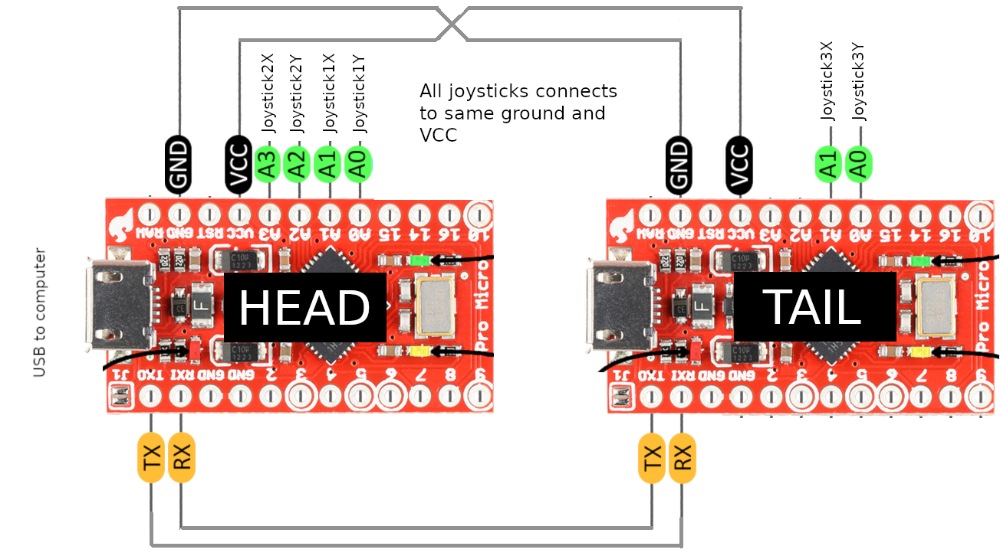
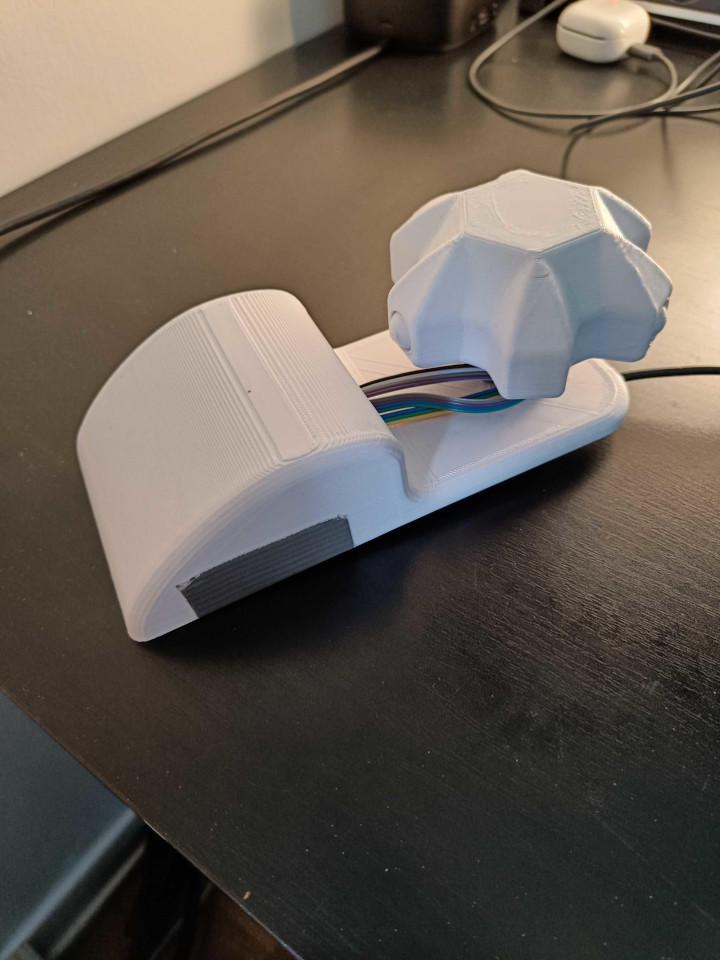
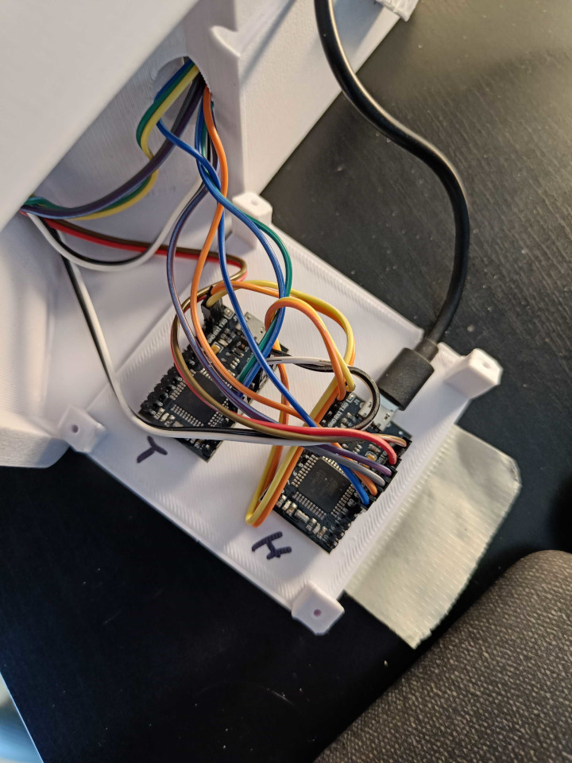

# 🖱️ 6DofMouse 🐭

## Introduction 🚀

A home built 6 DOF CAD mouse.
Based on [Shinsaku Hiura's 'Space Mushroom'](https://www.thingiverse.com/thing:5739462), mentioned in [this Hackaday article](https://hackaday.com/2022/12/28/mouse-enjoys-its-freedom/). I made some modifications.

## Modifications 🛠️

The 3D printed body is mostly the same, but I had to modify the internals.

I only had a couple of _Micro Pro Atmega32u4's_ at home. Which does not have enough analog pins. So I decided to daisy chain together two of them.
Calling them **HEAD** and **TAIL**.

## Dependencies 🔗

### Blender add-on

To make it easier and, in my opinion, better. I decided to only support Blender. Thus making it depend on a Blender add-on.
[Source code for Blender add-on](https://github.com/NangiDev/Blender6DofMouseAddon)

## Curcuit 💻

The curcuit looks something like this:

```
          Joystick1
              |
Computer <-> HEAD <-> TAIL <-> Joystick3
              |
          Joystick2
```

### Detailed curcuit 🧬

<a href="/blob/main/images/atmega32u4.png" onclick="showImage('images/atmega32u4.png')">
  
</a>

## Pictures

### Externals

<a href="#" onclick="showImage('images/externals.jpg')">
  
</a>

### Internals

<a href="#" onclick="showImage('images/internals.jpg')">
  
</a>

<script>
function showImage(imageURL) {
  window.open(imageURL);
}
</script>
